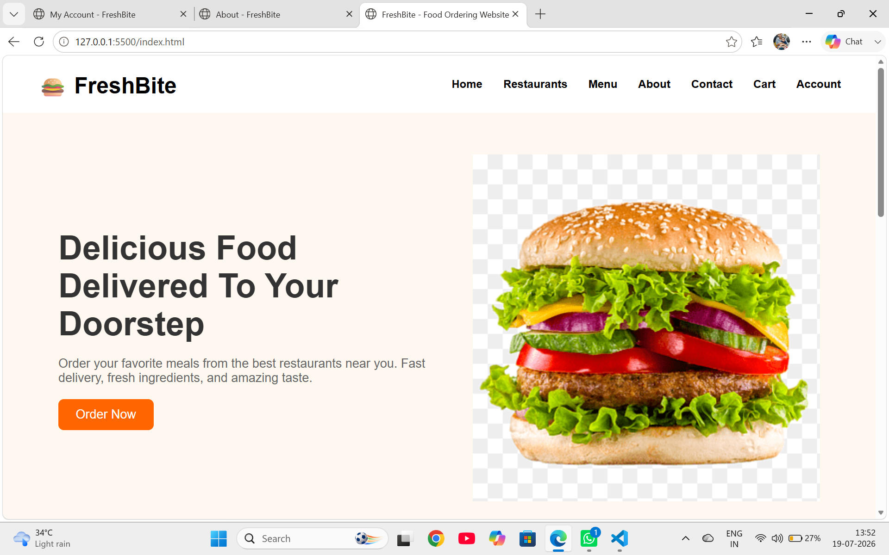

# 🍔 FreshBite – Food Ordering Website

# 🍔 FreshBite - Food Ordering Website

FreshBite is a responsive multi-page food ordering website developed using HTML5, CSS3, and JavaScript. It allows users to explore restaurants, browse menus, add food items to the cart, manage their account, and proceed to checkout. This project was created as part of a Web Development Internship to demonstrate front-end web development skills.

## ✨ Features

- 🏠 Home Page
- 🍽️ Restaurant Listing
- 📋 Food Menu
- 🛒 Add to Cart
- 👤 Login & Account Page
- 💳 Checkout Page
- 📞 Contact Page
- ℹ️ About Page
- 📱 Fully Responsive Design

## 🛠️ Technologies Used

- HTML5
- CSS3
- JavaScript

## 📌 Project Status

✅ Completed

## 👩‍💻 Developer
## 📸 Project Preview

**Shagun Verma**
